# Exam template for 02476 Machine Learning Operations

This is the report template for the exam. Please only remove the text formatted as with three dashes in front and behind
like:

```--- question 1 fill here ---```

Where you instead should add your answers. Any other changes may have unwanted consequences when your report is
auto-generated at the end of the course. For questions where you are asked to include images, start by adding the image
to the `figures` subfolder (please only use `.png`, `.jpg` or `.jpeg`) and then add the following code in your answer:

```markdown

```

In addition to this markdown file, we also provide the `report.py` script that provides two utility functions:

Running:

```bash
python report.py html
```

Will generate a `.html` page of your report. After the deadline for answering this template, we will auto-scrape
everything in this `reports` folder and then use this utility to generate a `.html` page that will be your serve
as your final hand-in.

Running

```bash
python report.py check
```

Will check your answers in this template against the constraints listed for each question e.g. is your answer too
short, too long, or have you included an image when asked. For both functions to work you mustn't rename anything.
The script has two dependencies that can be installed with

```bash
pip install typer markdown
```

## Overall project checklist

The checklist is *exhaustive* which means that it includes everything that you could do on the project included in the
curriculum in this course. Therefore, we do not expect at all that you have checked all boxes at the end of the project.
The parenthesis at the end indicates what module the bullet point is related to. Please be honest in your answers, we
will check the repositories and the code to verify your answers.

### Week 1

* [X] Create a git repository (M5)
* [X] Make sure that all team members have write access to the GitHub repository (M5)
* [X] Create a dedicated environment for you project to keep track of your packages (M2)
* [X] Create the initial file structure using cookiecutter with an appropriate template (M6)
* [X] Fill out the `data.py` file such that it downloads whatever data you need and preprocesses it (if necessary) (M6)
* [X] Add a model to `model.py` and a training procedure to `train.py` and get that running (M6)
* [X] Remember to fill out the `requirements.txt` and `requirements_dev.txt` file with whatever dependencies that you
    are using (M2+M6)
* [X] Remember to comply with good coding practices (`pep8`) while doing the project (M7)
* [X] Do a bit of code typing and remember to document essential parts of your code (M7)
* [X] Setup version control for your data or part of your data (M8)
* [X] Add command line interfaces and project commands to your code where it makes sense (M9)
* [X] Construct one or multiple docker files for your code (M10)
* [X] Build the docker files locally and make sure they work as intended (M10)
* [X] Write one or multiple configurations files for your experiments (M11)
* [X] Used Hydra to load the configurations and manage your hyperparameters (M11)
* [X] Use profiling to optimize your code (M12)
* [X] Use logging to log important events in your code (M14)
* [X] Use Weights & Biases to log training progress and other important metrics/artifacts in your code (M14)
* [X] Consider running a hyperparameter optimization sweep (M14)
* [ ] Use PyTorch-lightning (if applicable) to reduce the amount of boilerplate in your code (M15)

### Week 2

* [X] Write unit tests related to the data part of your code (M16)
* [X] Write unit tests related to model construction and or model training (M16)
* [X] Calculate the code coverage (M16)
* [X] Get some continuous integration running on the GitHub repository (M17)
* [X] Add caching and multi-os/python/pytorch testing to your continuous integration (M17)
* [X] Add a linting step to your continuous integration (M17)
* [X] Add pre-commit hooks to your version control setup (M18)
* [ ] Add a continues workflow that triggers when data changes (M19)
* [ ] Add a continues workflow that triggers when changes to the model registry is made (M19)
* [X] Create a data storage in GCP Bucket for your data and link this with your data version control setup (M21)
* [X] Create a trigger workflow for automatically building your docker images (M21)
* [X] Get your model training in GCP using either the Engine or Vertex AI (M21)
* [X] Create a FastAPI application that can do inference using your model (M22)
* [X] Deploy your model in GCP using either Functions or Run as the backend (M23)
* [X] Write API tests for your application and setup continues integration for these (M24)
* [X] Load test your application (M24)
* [ ] Create a more specialized ML-deployment API using either ONNX or BentoML, or both (M25)
* [ ] Create a frontend for your API (M26)

### Week 3

* [ ] Check how robust your model is towards data drifting (M27)
* [X] Deploy to the cloud a drift detection API (M27)
* [ ] Instrument your API with a couple of system metrics (M28)
* [ ] Setup cloud monitoring of your instrumented application (M28)
* [X] Create one or more alert systems in GCP to alert you if your app is not behaving correctly (M28)
* [X] If applicable, optimize the performance of your data loading using distributed data loading (M29)
* [ ] If applicable, optimize the performance of your training pipeline by using distributed training (M30)
* [ ] Play around with quantization, compilation and pruning for you trained models to increase inference speed (M31)

### Extra

* [ ] Write some documentation for your application (M32)
* [ ] Publish the documentation to GitHub Pages (M32)
* [ ] Revisit your initial project description. Did the project turn out as you wanted?
* [X] Create an architectural diagram over your MLOps pipeline
* [ ] Make sure all group members have an understanding about all parts of the project
* [X] Uploaded all your code to GitHub

## Group information

### Question 1
> **Enter the group number you signed up on <learn.inside.dtu.dk>**
>
> Answer:

83

### Question 2
> **Enter the study number for each member in the group**
>
> Example:
>
> *sXXXXXX, sXXXXXX, sXXXXXX*
>
> Answer:

s203822, s243266, s205717, s205421, s203768

### Question 3
> **A requirement to the project is that you include a third-party package not covered in the course. What framework**
> **did you choose to work with and did it help you complete the project?**
>
> Recommended answer length: 100-200 words.
>
> Example:
> *We used the third-party framework ... in our project. We used functionality ... and functionality ... from the*
> *package to do ... and ... in our project*.
>
> Answer:

For our project, we have used several open source, third party frameworks not covered in the course, such as [CNNDetection](https://github.com/PeterWang512/CNNDetection), and also [pytest-cov](https://pypi.org/project/pytest-cov/) (Not to be confused with `coverage`), etc.

The most significant of these was `CNNDetection`, which is what we will focus on in this response. Since we are working with GANs (Generative Adversarial Networks), it can be hard to get proper validation metrics of which models perform well. Now, `CNNDetection` is a library, specialised in detecting whether an image was generated using CNN-based GANs ([See their page here](https://peterwang512.github.io/CNNDetection/)). Our idea is to exploit this library to essentially tell us "how AI-generated" our generated images look.

`CNNDetection` has some interesting quirks, for one it predicts that $\sim 20\%$ of the CIFAR-100 dataset is AI-generated, so either our assumption of our training data being real is wrong, or, more likely, `CNNDetection` is not a perfect model. For this reason we have instead implemented the following procedure for evaluation:

1. We generate $n_{fake}$ images with our model, and sample another  $n_{real}$ images from the CIFAR-100 test set.
2. We run the `CNNDetection` algorithm on both sets, logging the percentage of images it denotes as `real` in each set $p_{real}$ and $p_{fake}$.
3. We then run a statistical test for wether $ p_{real} = p_{fake} $, essentially assuming that if these two are the same, then our generator creates images similar to the training data.

$$ z = \frac{(p_{real }- p_{fake})}  {\sqrt{\hat{p} \cdot (1 - \hat{p}) \cdot (\frac{1}{n_{real}}  + \frac{1}{n_{fake}} )}},  $$
where
$$ \hat{p}= \frac{n_{real} \cdot p_{real} + n_{fake} \cdot p_{fake}}{n_{real} + n_{fake}}, $$
which is compared to a standard normal distribution, to get a p-values.

Now, `CNNDetection` did *not* end up being a significant part of our project. we have implemented the above test, to take a trained model an evaluate it. The ideal scenario would be to use the same algorithm during training, to evaluate the current model (essentially just an extra pre-trained non-fluctuating discriminator), perhaps even having a `wandb` sweep try to maximize a p-value. However, `CNNDetection` is, very interestingly, quite certain that random noise is *not* AI-generated, which means that our initial models, before training, acutally perform quite well using this metric... which makes optimization weird. It's also quite slow to do this.


## Coding environment

> In the following section we are interested in learning more about you local development environment. This includes
> how you managed dependencies, the structure of your code and how you managed code quality.

### Question 4

> **Explain how you managed dependencies in your project? Explain the process a new team member would have to go**
> **through to get an exact copy of your environment.**
>
> Recommended answer length: 100-200 words
>
> Example:
> *We used ... for managing our dependencies. The list of dependencies was auto-generated using ... . To get a*
> *complete copy of our development environment, one would have to run the following commands*
>
> Answer:

For managing our dependencies, we used a combination of `conda` and `pip`. The list of dependencies for the project was managed (and hence auto-generated) using `pipreqs` to write the `requirements.txt` file, and then, to avoid overlaps with the `requirements_dev.txt` (where we would manually put development dependencies and specify their version, by checking the installed version using `pip list`), we setup a pipeline to check that there are no overlapping dependencies using GitHub Actions (`check_python_requirements.yaml`).

To setup an exact copy of the development environment, the following steps should be followed:

* Firstly, they need to be invited to our Google Cloud Project, such that they have access to the dvc bucket for the data (ask our members for access).
* Secondly, they need to have gcloud suite setup from command line, by following the instructions from [here](https://cloud.google.com/sdk/docs/install).
* Thirdly, they need to follow the rest of the gcloud setup guide found at the following [repo](https://skaftenicki.github.io/dtu_mlops/s6_the_cloud/cloud_setup/).
* Alternatively, they can skip the whole above process if they don't intend to use the `dvc` data by running `invoke preprocess-data`
* Finally, they can configure the actual dependencies and python environment:
* `conda create --name Group83Env python=3.11`
* `cd <repository root>`
* `pip install -r requirements.txt`
* `pip install -r requirements_dev.txt`
* `pip install -e .`
* `dvc pull --no-run-cache`

### Question 5

> **We expect that you initialized your project using the cookiecutter template. Explain the overall structure of your**
> **code. What did you fill out? Did you deviate from the template in some way?**
>
> Recommended answer length: 100-200 words
>
> Example:
> *From the cookiecutter template we have filled out the ... , ... and ... folder. We have removed the ... folder*
> *because we did not use any ... in our project. We have added an ... folder that contains ... for running our*
> *experiments.*
>
> Answer:

We have used most of the stuff from the Cookiecutter template, e.g. `src`, `models` and `data`. The only thing we did not end up using was the `notebooks` folder, as we never ended up actually making any.

We have added a folder called `CNNDetection`, mainly for the reason of clear distinction between code we wrote, and code we "borrowed" from others.

In general, the Cookiecutter template was proven useful, as it set up directories for compartmentalizing our files. However, we ended up with a couple of extra files in the working directory that we could have fond a better place for them.

### Question 6

> **Did you implement any rules for code quality and format? What about typing and documentation? Additionally,**
> **explain with your own words why these concepts matters in larger projects.**
>
> Recommended answer length: 100-200 words.
>
> Example:
> *We used ... for linting and ... for formatting. We also used ... for typing and ... for documentation. These*
> *concepts are important in larger projects because ... . For example, typing ...*
>
> Answer:

We implimented a pre-commit.yaml file which checks if the code follows the PEP8 standard.
We added some exceptions to this, e.g. in train.py we had dependencies which the linter could not find, so we allowed them not to be checked by said linter.
The linter in question was ruff.
The pre-commit.yaml file automatically format the code after the first commit.
Lastly we implemented a github action which checks the code format, we decided not to make this a required action to merge with main.

These concepts are important in larger projects because you need some uniformity within the project even with a lot of people working on it. 

## Version control

> In the following section we are interested in how version control was used in your project during development to
> corporate and increase the quality of your code.

### Question 7

> **How many tests did you implement and what are they testing in your code?**
>
> Recommended answer length: 50-100 words.
>
> Example:
> *In total we have implemented X tests. Primarily we are testing ... and ... as these the most critical parts of our*
> *application but also ... .*
>
> Answer:

We implemented unit tests for the api, data, model, monitoring and training.
for the api, using a post operation, we test whether the model can generate an image from a sentence.

For the data we first test whether the dataset is of the correct type, then we test the expected dataset sizes and that each element within a dataloader is of the expected instance, and lastly we check that normalization occurs as expected.

The model tests that the generator class can be initialized properly, and that it output is appropriate given two distinct inputs.

Monitoring tests that we get an OK repsonse from report generated using data-drift-report.

Training tests that Hydra works as expected.

### Question 8

> **What is the total code coverage (in percentage) of your code? If your code had a code coverage of 100% (or close**
> **to), would you still trust it to be error free? Explain you reasoning.**
>
> Recommended answer length: 100-200 words.
>
> Example:
> *The total code coverage of code is X%, which includes all our source code. We are far from 100% coverage of our **
> *code and even if we were then...*
>
> Answer:

Code covereage is displayed as a badge in the repository
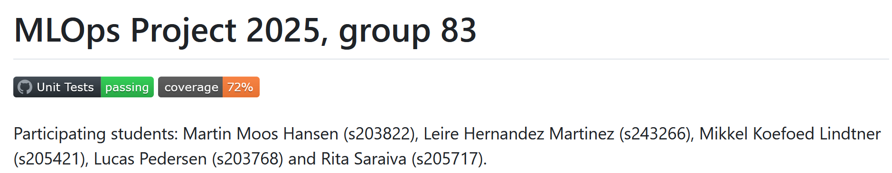
*Note* screenshot taken at 12:52 on Jan 24., so this may be a bit wrong, but hopefully not.

Even if we had gone to 100\% code coverage, this could not have gauranteed that we would have no errors. Edge cases exists, and we have certainly not gone out of our way in an attempt to find them in this project. Additionally coverage can only address what we test, and there are definitely more tests that could be added still.

### Question 9

> **Did you workflow include using branches and pull requests? If yes, explain how. If not, explain how branches and**
> **pull request can help improve version control.**
>
> Recommended answer length: 100-200 words.
>
> Example:
> *We made use of both branches and PRs in our project. In our group, each member had an branch that they worked on in*
> *addition to the main branch. To merge code we ...*
>
> Answer:

We have made plenty use of both branches and pull requests in this project. Branches have been a significant help in regards to parallelising tasks, s.t. individual group members could work on different parts of the code, without interferring. Suprisingly the branches have actually also been helpful when a group member needed aid in sorting out a specific issue on their branch, since another group member could easily just switch branch, and try out the new code for themselves, instead of everyone just looking over shoulders, and running stuff on one PC.

We set up pull requests to work along tests, e.g. "Are you attempting to commit large files?", this helped ensuring no major errors would make their way into the main branch. To make our lives easier, we did set it up so any group member could create their own pull request, and merge their branch into main.

With respect to version control, we did luckily not have any large enough issues to actually have to revert changes, but it was sometimes helpful to be able to just close a branch, if you messed it up enough.

### Question 10

> **Did you use DVC for managing data in your project? If yes, then how did it improve your project to have version**
> **control of your data. If no, explain a case where it would be beneficial to have version control of your data.**
>
> Recommended answer length: 100-200 words.
>
> Example:
> *We did make use of DVC in the following way: ... . In the end it helped us in ... for controlling ... part of our*
> *pipeline*
>
> Answer:

We did set up DVC for this project, though not exactly for its inteded purposes. Since we never actually changed our dataset (the CIFAR-100 dataset is fairly stationary), we have only done a mock run of DVC by pushing the CIFAR-10 dataset first, and then just overwriting it with our actual data afterwards. This was just to enable us to actually do something with the data-drift monitoring exercises later.

Data version control would definitely be helpful in a scenario where we actually expected to expand our training data. For us, in the context of GANs, this could perhaps correspond to finding more images of the same targets or expanding the range of targets (one could certainly imagine wanting to generate images of something other than bears or tables).

### Question 11

> **Discuss you continuous integration setup. What kind of continuous integration are you running (unittesting,**
> **linting, etc.)? Do you test multiple operating systems, Python  version etc. Do you make use of caching? Feel free**
> **to insert a link to one of your GitHub actions workflow.**
>
> Recommended answer length: 200-300 words.
>
> Example:
> *We have organized our continuous integration into 3 separate files: one for doing ..., one for running ... testing*
> *and one for running ... . In particular for our ..., we used ... .An example of a triggered workflow can be seen*
> *here: <weblink>*
>
> Answer:

--- question 11 fill here ---

## Running code and tracking experiments

> In the following section we are interested in learning more about the experimental setup for running your code and
> especially the reproducibility of your experiments.

### Question 12

> **How did you configure experiments? Did you make use of config files? Explain with coding examples of how you would**
> **run a experiment.**
>
> Recommended answer length: 50-100 words.
>
> Example:
> *We used a simple argparser, that worked in the following way: Python  my_script.py --lr 1e-3 --batch_size 25*
>
> Answer:

We ended up setting up two training commands, one using hydra and one using wandb, both of which are called with the `invoke` framework. So we would call either

`invoke train-hydra --experiment.yaml` or `invoke train-wandb --arg1...`

so hydra training takes a yaml file describing the experiment, the wandb takes arguments (sutch as batch size and learning rate). The `train-wandb` was set up this way, so it was easy to set up a hyperparameter sweep, which just parsed arguments to the function, we essentially never actually ran `invoke train-wandb --arg1...`, since its very tedious to write the arguments in by hand.

### Question 13

> **Reproducibility of experiments are important. Related to the last question, how did you secure that no information**
> **is lost when running experiments and that your experiments are reproducible?**
>
> Recommended answer length: 100-200 words.
>
> Example:
> *We made use of config files. Whenever an experiment is run the following happens: ... . To reproduce an experiment*
> *one would have to do ...*
>
> Answer:

To us at least, it seems like making use of wandbs logging is the simpelest way to keep track of experiments, escpecially when performing hyperparameter sweeps. Since wandb can just save the trained models as artifacts, and each of these artifacts are then linked to which ever hyperparameters helped create them, it's very simple to just look up which parameters to use.

In our case with GANs, where the biggest criteria for a good model is "this image looks good to me" we just log images as here, and just view hyperparameters in the provided visalisation

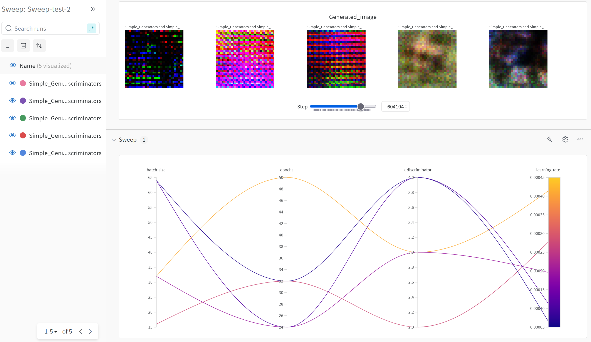
*Note* our models suck, and the only things to take away from this image is that we can visualize and log stuff.

Hydra solves the issue of reproducability by simply requiring a config file to run. You can then either just create new .yaml files for each experiment, and just keep track of run-names, or remember to commit to git, which will then also version control your files, s.t. even if you mess up and delete/overwrite and experiment, you can still find it.

### Question 14

> **Upload 1 to 3 screenshots that show the experiments that you have done in W&B (or another experiment tracking**
> **service of your choice). This may include loss graphs, logged images, hyperparameter sweeps etc. You can take**
> **inspiration from [this figure](figures/wandb.png). Explain what metrics you are tracking and why they are**
> **important.**
>
> Recommended answer length: 200-300 words + 1 to 3 screenshots.
>
> Example:
> *As seen in the first image when have tracked ... and ... which both inform us about ... in our experiments.*
> *As seen in the second image we are also tracking ... and ...*
>
Answer:
In this first image we see the stats we log in wandb. For the most parts its just different loss functions, but we also stop every once in a while and generate an image with our model, and ask `CNNDetection` how AI-generated it looks (this is shown in the graph labeled synthetic prob), this is acutally a fairly interesting graph, and one might wonder why it believes our noise is not AI-generated.
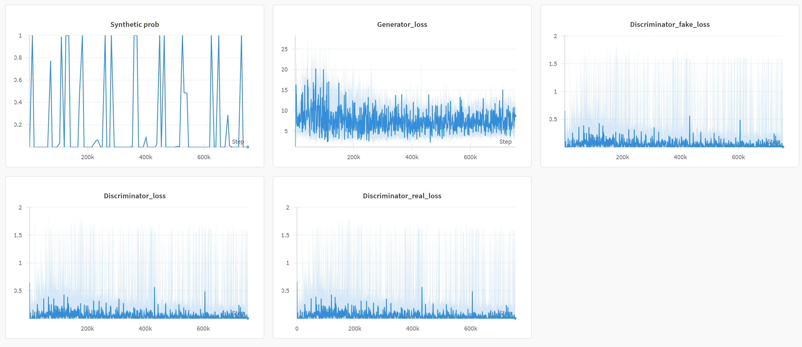

In the same experiment we have logged examples of images over the training. Here we see a few samples over the training period, and notice that this model seems to have learned that black images with some sporadic extreme dots of red/blue/green is the way to go.
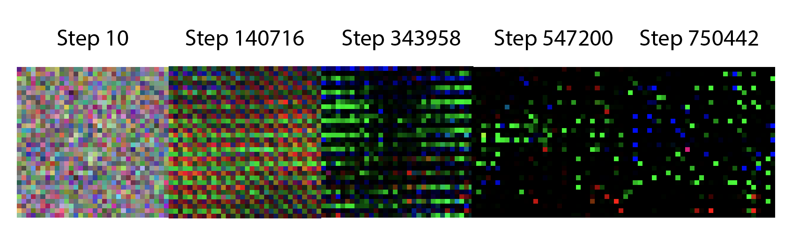

For the purposes of reproducability, we can go to the overview tab, and see the hyperparameters that lead to this were
- $batch\_ size = 32$
- $epochs = 50$
- $k\_ discriminator = 3$
- $learning\_ rate = 4.1 \cdot 10^{-4}$


### Question 15

> **Docker is an important tool for creating containerized applications. Explain how you used docker in your**
> **experiments/project? Include how you would run your docker images and include a link to one of your docker files.**
>
> Recommended answer length: 100-200 words.
>
> Example:
> *For our project we developed several images: one for training, inference and deployment. For example to run the*
> *training docker image: `docker run trainer:latest lr=1e-3 batch_size=64`. Link to docker file: <weblink>*
>
> Answer:

For our project we developed several images: one for training, one for the API backend, and one for data drift monitoring.

For the deployment of the model we have created a docker image that runs the API with python's FastAPI module, and a docker container that monitors data drifting.

When we were still running our docker images locally, we run `docker run trainer:latest ...` adding the experiment specific parameters, and mounting the volumes when we were still saving the models locally. Link to the docker images: [here](europe-west1-docker.pkg.dev/mlops-project-group83/docker-images/train:latest)

For Continuous Integration purposes, every time code is pushed to the main branch, the docker image building is triggered in Google Cloud and images are then pushed to the Artifact Registry.

### Question 16

> **When running into bugs while trying to run your experiments, how did you perform debugging? Additionally, did you**
> **try to profile your code or do you think it is already perfect?**
>
> Recommended answer length: 100-200 words.
>
> Example:
> *Debugging method was dependent on group member. Some just used ... and others used ... . We did a single profiling*
> *run of our main code at some point that showed ...*
>
> Answer:
Experiments can have a lot of meanings.

For general python files we used the debugger within python, e.g. for vscode we setup breakpoints and saw the states of the code at its point of failure.

When training on the cloud computer caused issues, we used the information provided by google cloud, e.g. logs and error messages to debug the problem.

We ensured that actions on github, which included linter checks and unit tests were performed pre-commit so appropriate actions could be taken before merging with the main branch.

Right after training, we profiled the code but time constraints did not allow us to make the code faster.

--- question 16 fill here ---

## Working in the cloud

> In the following section we would like to know more about your experience when developing in the cloud.

### Question 17

> **List all the GCP services that you made use of in your project and shortly explain what each service does?**
>
> Recommended answer length: 50-200 words.
>
> Example:
> *We used the following two services: Engine and Bucket. Engine is used for... and Bucket is used for...*
>
> Answer:

In our project, we have made use of the following GCP Services:
* Cloud Run -- We used this service for the deployment of our service in the end (both for the api-image container (model deployment) and data-drift-report-generator (data drift checker)).

* Cloud Build -- We used this service to automatically build the docker images for the model training backend, as well as the deployment API system.

* Vertex AI (Custom Jobs) -- We used this to train our models.

* Cloud Storage (Buckets) -- We used this for storing our training data (through DVC), our models, and images generated by our users.

* Artifact Registry -- We used this service to store our docker images.

* Monitoring -- We used this for giving alerts in case of oddities during training of models, or when deployment begins to error.


### Question 18

> **The backbone of GCP is the Compute engine. Explained how you made use of this service and what type of VMs**
> **you used?**
>
> Recommended answer length: 100-200 words.
>
> Example:
> *We used the compute engine to run our ... . We used instances with the following hardware: ... and we started the*
> *using a custom container: ...*
>
> Answer:

We did not use Google Cloud's Compute Engine for our project, since many of the other Google Cloud services, such as Vertex AI, Cloud Build, etc. covered our use case more effectively than the Compute Engine.

If we were to have used the Compute Engine, we would have used it for model training with GPU Acceleration, where we would have setup our project akin to how it is setup in the GitHub actions (installing the requirements, etc.) and then manually running the train command with the config: `python src/group83_mlops/train.py train-hydra --experiment=exp3`, where the experiment has been changed to match the desired experiment, and then using the shared google bucket mount with `/gcs/bucket_name` to upload the model pickles at the end.

### Question 19

> **Insert 1-2 images of your GCP bucket, such that we can see what data you have stored in it.**
> **You can take inspiration from [this figure](figures/bucket.png).**
>
> Answer:

We have several buckets, so we will show the one with our DVC data in it:

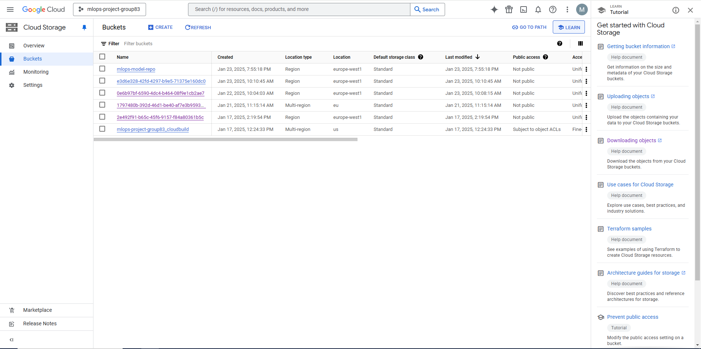

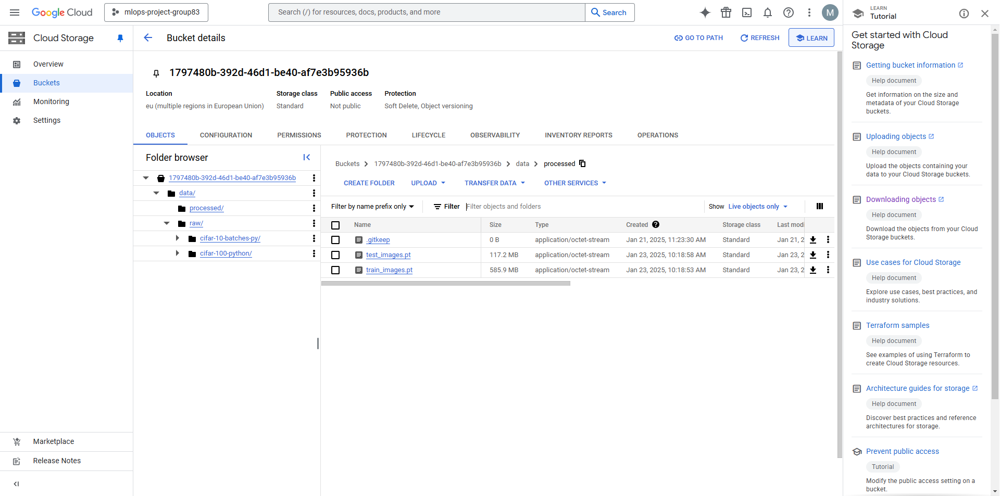

### Question 20

> **Upload 1-2 images of your GCP artifact registry, such that we can see the different docker images that you have**
> **stored. You can take inspiration from [this figure](figures/registry.png).**
>
> Answer:

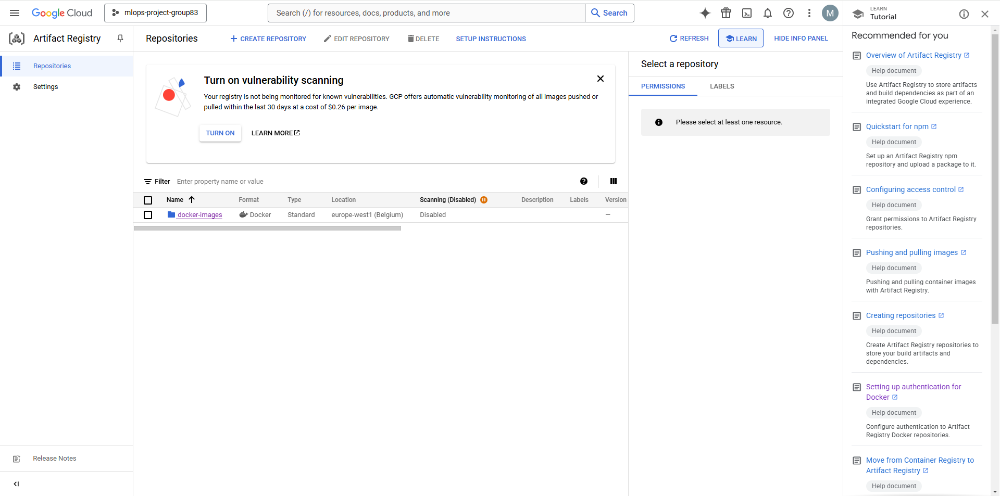

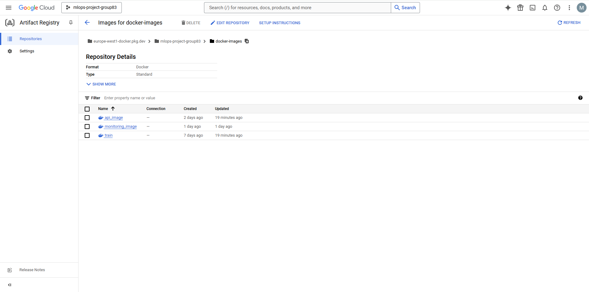

### Question 21

> **Upload 1-2 images of your GCP cloud build history, so we can see the history of the images that have been build in**
> **your project. You can take inspiration from [this figure](figures/build.png).**
>
> Answer:

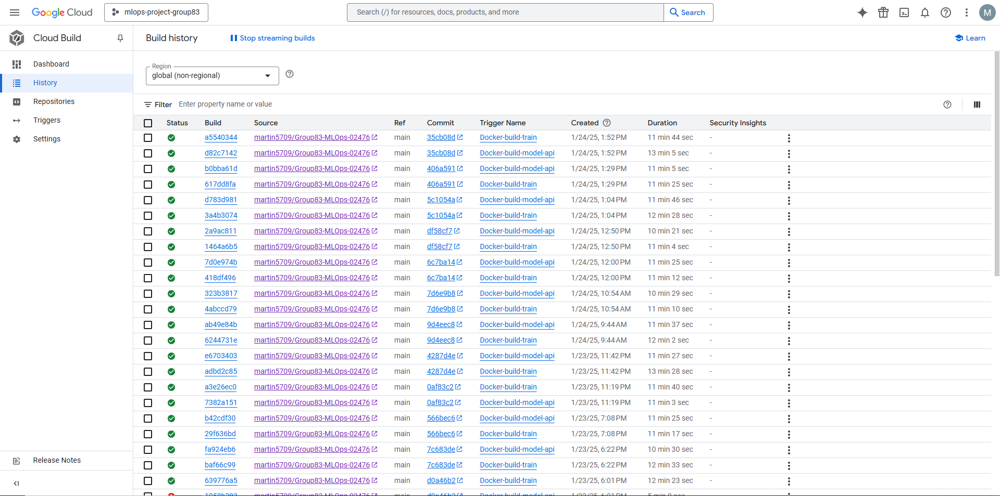

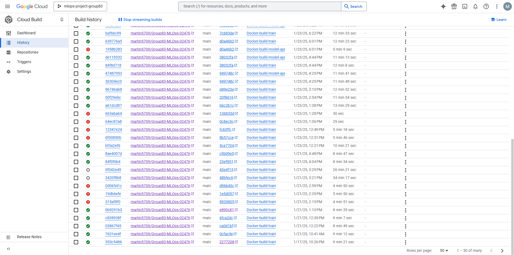

### Question 22

> **Did you manage to train your model in the cloud using either the Engine or Vertex AI? If yes, explain how you did**
> **it. If not, describe why.**
>
> Recommended answer length: 100-200 words.
>
> Example:
> *We managed to train our model in the cloud using the Engine. We did this by ... . The reason we choose the Engine*
> *was because ...*
>
> Answer:

Yes. We managed to train our model in the cloud using Vertex AI (Both CPU and GPU (as we were fortunate enough to be allocated a GPU quota)).

We did this by firstly having the docker image for the training (train.dockerfile) be built on Google Cloud (and saved as an Artifact) whenever a push happens to main, and then creating a new vertex instance using either one of our two scripts: `manual_vertex_run_cpu.sh` or `manual_vertex_run_gpu.sh`. One may need to change the experiment parameter to run the experiment of interest. Then, upon complete model training, it automatically pushes the files to a Google Cloud Bucket (`mlops-model-repo`), which is then used later in the API pipeline.

The reason why we chose Vertex AI, because it streamlines training more effectively than our previous method of training our models on DTU's HPC system manually using bash jobs.

## Deployment

### Question 23

> **Did you manage to write an API for your model? If yes, explain how you did it and if you did anything special. If**
> **not, explain how you would do it.**
>
> Recommended answer length: 100-200 words.
>
> Example:
> *We did manage to write an API for our model. We used FastAPI to do this. We did this by ... . We also added ...*
> *to the API to make it more ...*
>
> Answer:

We have made an API for our model using FastAPI. The API essentially downloads a model form our gcloud bucket (mlops-model-repo), and when recivieng a request, it responds by generating an image, using this model. The API doesn't really take any input, since its just a GAN you can't really request anything specific from it. However we recommend asking it nicely anyway, since this gives better performance (citation needed).

We also save any image generated by this model in a different bucket (0e6b97bf-6590-4dc4-b464-08f9e1cb2ae7) (random UUID of our choosing). Currently we do not have a good use for these images, but it seems like a nice thing to have in future scenarios.

The API is a semi-integrated component of the pipeline. Whenever a Vertex AI job is run, the models are updated in the bucket, and then redeploying the Cloud Run service, it will fetch the new model.


### Question 24

> **Did you manage to deploy your API, either in locally or cloud? If not, describe why. If yes, describe how and**
> **preferably how you invoke your deployed service?**
>
> Recommended answer length: 100-200 words.
>
> Example:
> *For deployment we wrapped our model into application using ... . We first tried locally serving the model, which*
> *worked. Afterwards we deployed it in the cloud, using ... . To invoke the service an user would call*
> *`curl -X POST -F "file=@file.json"<weburl>`*
>
> Answer:

We have deployed our API both locally, and to the cloud. Initially only locally, for easier debugging and to ensure it worked. When it did build a docker image, and deployed this on cloud run.

The API we deployed is very simple. Given a request, the server simply sends back a random image. This should hopefully be possible to do with curl using

```sh
curl -X POST "https://api-image-5307485050.europe-west1.run.app/generate" \
     -H "Content-Type: application/json" \
     -d '{"request": "Please make me an image :D"}' \
     --output generated_image.png
```

We also made a python script `test_api.py` in the tests folder, which essentially does the same, just in a way that's nicer to call.


*NOTE* Our model sucks, so the downloaded image will just be 32x32 pixels of "abstract art".


### Question 25

> **Did you perform any unit testing and load testing of your API? If yes, explain how you did it and what results for**
> **the load testing did you get. If not, explain how you would do it.**
>
> Recommended answer length: 100-200 words.
>
> Example:
> *For unit testing we used ... and for load testing we used ... . The results of the load testing showed that ...*
> *before the service crashed.*
>
> Answer:

We are performing some very simple unittests on our API, e.i. check if the server is running, and if it sends us a png on request, but nothing else.

For load tests we did a few quick ones using locust. We did 3 quick experiments, each of 60 seconds. The first had 1 user, then 10 users and lastly 50 users. As we see respone time scales very poorly with number of users, going up to $ \sim 5 $ seconds at the $ 50 $'th percentile when having 50 users. Interestingly, we only had failures when we used 10 users, but had none with 50 users. 

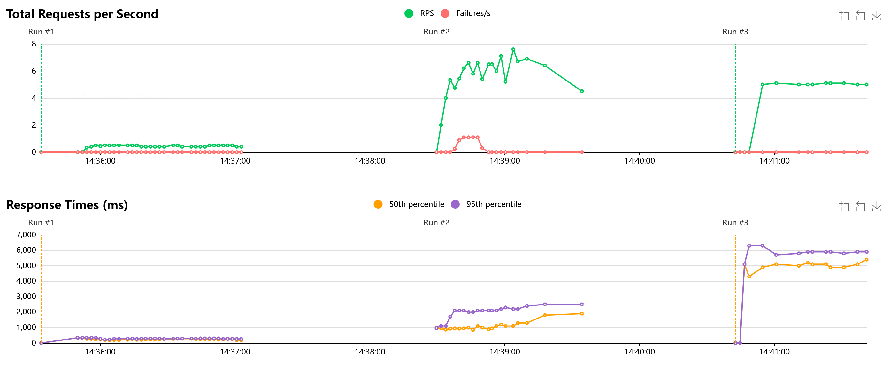

### Question 26

> **Did you manage to implement monitoring of your deployed model? If yes, explain how it works. If not, explain how**
> **monitoring would help the longevity of your application.**
>
> Recommended answer length: 100-200 words.
>
> Example:
> *We did not manage to implement monitoring. We would like to have monitoring implemented such that over time we could*
> *measure ... and ... that would inform us about this ... behaviour of our application.*
>
> Answer:

We did not end up implementing monitoring on our model. Mainly because we could not find a purpose for it. Since we're just training unconditional GANs we have no real use for tracking it's output, since, assuming we actually made a well-trained model, would always just generate images which are similar to the training data. This should never change, and there is not way usage of a trained model could actually drift.

However, just to get a feeling of how to acutally implemenent monitoring, we did set up monitoring on our training data. We have an API, which given the request
```sh
curl -X GET "https://data-drift-report-generator-5307485050.europe-west1.run.app/report?n=<N-IMAGES>" --output report.html
```
or a call to `test_monitoring.py` in the tests folder. Downloads the current and previous versions of of our training data, from our dvc-bucket, and creates a report using `evidently`. The variable `n` is how many images to take into this report (using all 50000 images in our training data takes a while, so we just select a subsample to actually report on).
As discussed in the dvc-part of the report, we never really used dvc, since we never changed our dataset. So right now this report just tries to detect drift between CIFAR-10 and CIFAR-100. The report compares the 512 features from the CLIP-model, as in the exercises.

In the future we imagine this feature could be useful when acually expandning training data, in askin how similar two sets actually are.

## Overall discussion of project

> In the following section we would like you to think about the general structure of your project.

### Question 27

> **How many credits did you end up using during the project and what service was most expensive? In general what do**
> **you think about working in the cloud?**
>
> Recommended answer length: 100-200 words.
>
> Example:
> *Group member 1 used ..., Group member 2 used ..., in total ... credits was spend during development. The service*
> *costing the most was ... due to ... . Working in the cloud was ...*
>
> Answer:

With regards to credits, as of 11:20 on Friday, we have spent a total of $ 3.57\, \$ $ in Google Cloud. We expect this number to be slightly wrong, since a group member decided to do GPU training in Vertex AI the night before this, and the billing report only shows $ 0.08\, \$ $ spent on Vertex AI.

The bulk of our credits where spent in Storage $( 2.37\, \$ ) $ and Artifact Registry $( 0.87\, \$)$, the rest is some mix of Vertex AI, Compute Engine an Cloud Run.

Overall working in the cloud is a somewhat frustating experience, but well worth the satisfaction, when you finally get your pibeline set up, and everything starts communicating.

### Question 28

> **Did you implement anything extra in your project that is not covered by other questions? Maybe you implemented**
> **a frontend for your API, use extra version control features, a drift detection service, a kubernetes cluster etc.**
> **If yes, explain what you did and why.**
>
> Recommended answer length: 0-200 words.
>
> Example:
> *We implemented a frontend for our API. We did this because we wanted to show the user ... . The frontend was*
> *implemented using ...*
>
> Answer:

--- question 28 fill here ---

### Question 29

> **Include a figure that describes the overall architecture of your system and what services that you make use of.**
> **You can take inspiration from [this figure](figures/overview.png). Additionally, in your own words, explain the**
> **overall steps in figure.**
>
> Recommended answer length: 200-400 words
>
> Example:
>
> *The starting point of the diagram is our local setup, where we integrated ... and ... and ... into our code.*
> *Whenever we commit code and push to GitHub, it auto triggers ... and ... . From there the diagram shows ...*
>
> Answer:

### *Diagram of project*
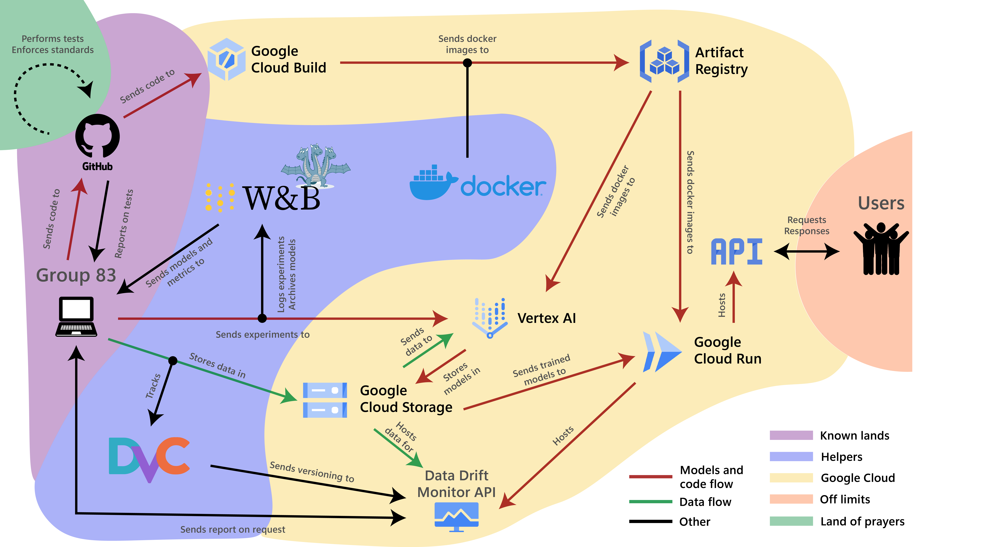

Our diagram is split into 5 colored regions, essentially just categorizing services we have used. Between services we have arrows. Starting at *Group 83* (the laptop left-center) it is possible to follow journeys of colored arrows through the landscape.

**Models and code flow**
In the local setup group members can work on individual branches of new features, once a feature is finished a pull request is sent to Github, where unit tests (and other standarizations) are run. If everything passes the members branch is merged into the main branch.

On this the model flow is triggered. Cloud build starts building new docker images, which are stored in the artifact registry (we currently have 3, one for each of training, API and monitoring). The training image contains information on training loop and model, it is however missing hyperparameters, such as batch size and learning rate.

When we wish to train a new model, a config file containing hyperparameters are sent to Vertex AI, which then pulls a training image from our Artifact Registry and Data from a Cloud Bucket, and trains a new model. This trained model is the stored in a bucket, where it awaits use. During all of this either Hydra or Wandb (which is chosen is a group member preference) keeps track of performed experiments (in the case of Wandb, models are also stored in a seperate registry, but this is mainly an artifact of code being writting in parallel).

The most recent trained model is ready for use, and is grabbed by our cloud run application, which also loads the other two images in the registry. The most recent model is now online, and potential users can interact with it through the API.

**Data flow**
Data is pushed from the local setup to a Cloud Bucket, DVC ensures we keep track of versioning. The newest version of the data is accessed by Vertex AI during training. Data is also accessed by our Data Drift Monitor, which is setup such that, when requested, it sends a report on data drift, comparing the most recent data set added to the bucket to the previous one.


### Question 30

> **Discuss the overall struggles of the project. Where did you spend most time and what did you do to overcome these**
> **challenges?**
>
> Recommended answer length: 200-400 words.
>
> Example:
> *The biggest challenges in the project was using ... tool to do ... . The reason for this was ...*
>
> Answer:


Large struggles was keeping up with version control, this included not just which package to import and their versions but also ensuring everyone had access to dvc, wandb and so forth.

Large amount of times were dedicated to connect different services which also was hard to debug and the debugging process itself was error prone, as machines sometimes tend to differ in subtle ways.

We also saw some problems in the subtlety between git and github when using the command line, e.g. some commands are not available just using git and the workflow of github took a while to setup.

A challenge of this project was getting docker containers to run in the cloud. The reason for this struggle was 3-fold. For one, building docker containers just takes a while, for us this means that any debugging just took ages, as a single deplyment to the cloud could take upto 25 minutes, before we got our error message, and could revisit the problem.

The second reason lies in reading logs from Google Cloud, when looking back at it, this should definitely not have been an issue at all, but for some reason the new UI just made the entire process of actually tracking down errors became more difficult than usual.

The last reason is a specific error in configuring service accounts, we did not realise that accessing stuff from a bucket in cloud run was done from a service account, which did not have access to buckets. Much time was spent debugging this.

To overcome this challenge we used TA's. They're a great resource when you're completely clueless of what an error could be, and were a great help in pointing out what we needed to look out for, when debugging on our own.

### Question 31

> **State the individual contributions of each team member. This is required information from DTU, because we need to**
> **make sure all members contributed actively to the project. Additionally, state if/how you have used generative AI**
> **tools in your project.**
>
> Recommended answer length: 50-300 words.
>
> Example:
> *Student sXXXXXX was in charge of developing of setting up the initial cookie cutter project and developing of the*
> *docker containers for training our applications.*
> *Student sXXXXXX was in charge of training our models in the cloud and deploying them afterwards.*
> *All members contributed to code by...*
> *We have used ChatGPT to help debug our code. Additionally, we used GitHub Copilot to help write some of our code.*
> Answer:

s205421: in charge of creating pre-commit.yaml files, making actions on github, setup cookie cutter project (we later pivoted to another template which martin setup), did profiling on the train and setup the first iteration of the dataloader and data class.

s203822: In general in charge of a lot of different tasks and infrastructure. The biggest of these being the Vertex AI management, hydra and typer configs, the model and training development, and GitHub actions for testing.

s243266: in charge of the docker file for training, Google Cloud Artifact and image building triggers.